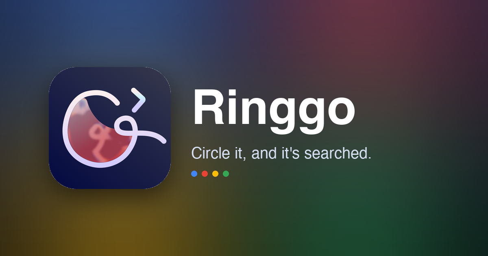

<div align="center">



# Ringgo

**屏幕上圈一下，就搜到了。**
*Circle anything on your screen to search — right on your Mac.*

一个常驻 macOS 菜单栏的「圈选搜索」工具：一个热键定住屏幕，圈一下、划一下、点一下，
就能用 Google 搜索、Lens 识图、翻译、扫码。

[](https://www.apple.com/macos/)
[](https://github.com/p2o51/Ringgo/releases/latest)
[](LICENSE.md)


[下载](https://github.com/p2o51/Ringgo/releases/latest) · [开发文档](docs/DEVELOPMENT.md) · [名字的由来](#-名字的由来)

</div>

---

## 这是什么

Ringgo 把手机上的「Circle to Search」搬到了 Mac。平时它安静地待在菜单栏，
按下热键就**冻结当前屏幕**，你画个圈 / 划一下 / 点一下选中任意文字或图片，
结果在一个悬浮小面板里弹出来——不打断你手头的事。

搜索走的是你自己的 Google，所以在 [Releases](https://github.com/p2o51/Ringgo/releases/latest) 上一直**可以免费获取**。

## ✨ 能做什么

|  |  |
|---|---|
| 🔎 **圈选即搜** | 画圈 / 划过 / 轻点，选中屏幕上的字与图，直接丢给 Google |
| 🈶 **本机认字** | 文字识别在你的 Mac 上跑（Apple Vision），中英日韩都认，离线也行 |
| 🌐 **就地翻译** | 一段字、一张图、整块屏幕，都能翻译，模型跑在本机 |
| 🖼️ **以图搜图** | 圈住任意画面区域，交给 Google Lens |
| 📊 **可视化 · 改图** | 把选中内容画成图表，或让 AI 编辑圈住的图片 |
| ▦ **扫码直达** | 二维码扫一下：开链接、连 Wi-Fi、存联系人、加日程 |
| 💬 **接着追问** | 在结果里补一句，图和问题一起接着问下去 |

## ⌨️ 怎么唤起

- **全局热键** — 默认 `⌘⇧S`，可自定义
- **蓄力唤起** — 按住 `⌘⇧` 约 250ms
- **三指双击** — 触控板任意位置（实验性）
- **菜单栏** — 点一下「立即圈选」

主热键与蓄力唤起**无需辅助功能权限**。

## 🔒 隐私

- 只在你按下热键那一下截一帧，**从不录像**
- 截图**不会自动上传**，只有你真的去搜时才发出去
- 认字与翻译用 Apple 本机模型，算力和数据都留在你机器上

## ⬇️ 下载安装

到 [**Releases**](https://github.com/p2o51/Ringgo/releases/latest) 下载最新的 `Ringgo-x.y.z.dmg`，打开后拖进「应用程序」即可。

> 需要 **macOS 14 或更高版本**（Apple 芯片与 Intel 通用）。
> 首次打开若被 Gatekeeper 拦下，在图标上右键 →「打开」一次即可。

## 🔨 从源码构建

需要 **Xcode**（不只是 Command Line Tools）。**零第三方依赖**，全部走系统框架。

```bash
# 跑测试
swift test

# 打出 Ringgo.app（release = arm64 + x86_64 通用二进制）
DEVELOPER_DIR=/Applications/Xcode.app/Contents/Developer Scripts/build-app.sh release
# 产物在 build/Ringgo.app
```

技术栈：Swift · SwiftUI + AppKit · Vision · ScreenCaptureKit · WebKit · Translation · Metal。
非沙盒 + Developer ID 直分发（三指双击用系统私有 MultitouchSupport，故不上架 Mac App Store）。

## 🌐 落地页

`web/` 是产品落地页——纯静态、单文件、离线自包含，含 hero 处「四色手势画圈 → 定格成图标」的动画：

```bash
python3 -m http.server --directory web 8000   # 打开 http://localhost:8000
```

## 📄 许可证

源码公开，采用 [**PolyForm Noncommercial License 1.0.0**](LICENSE.md)：
可自由用于**非商业**用途（个人、研究、教学、非营利组织），**商用需另行授权**。

## 🍎 名字的由来

**Ring**（圈）＋ **りんご**（苹果）—— 画一圈，搜苹果生态里的一切。

---

<div align="center">
更细的「做什么 / 长什么样 / 怎么实现」见
<a href="docs/features.md">功能规格</a> ·
<a href="docs/ui-style.md">UI 风格</a> ·
<a href="docs/circle2search-core-mechanisms.md">核心机制</a>
<br><sub>© 2026 Chen Wuyi · Made with 🔵🔴🟡🟢</sub>
</div>
